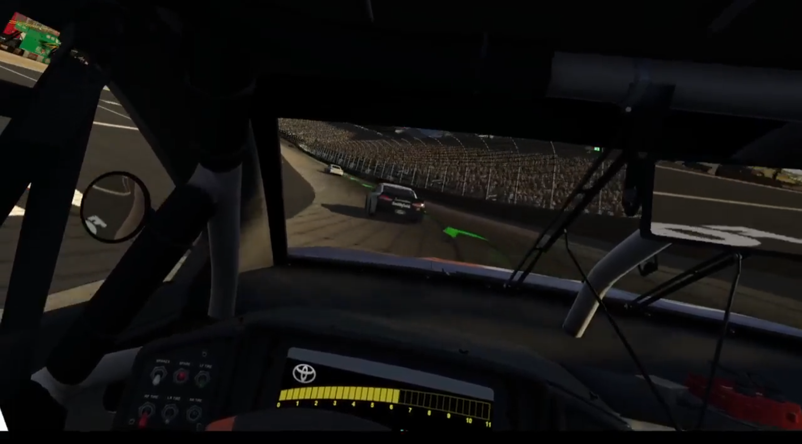

# Nascar-2003-VR-mod
VR mod for Nascar 2003

Instructions:
- Step 1: Install the game
- Step 2: Install BepinEx 5.4.21.0 x64 version! (unzip the zip file into the game folder)
- Step 3: Run the game once to setup BepinEx
- Step 4: Unzip the mod file into the game folder

#Issues:

- Main menu has bugs.  Not all game modes working.  

- No recenter position

- Use SteamVR or OVR advanced settings for recenter.

- Menus are controlled via desktop (use SteamVR Desktop button)

- Use camera view button to switch views.
- Both views are cockpit. The true cockpit view looks better but the game doesn' t render the back half of the car.
- Still playable.

Tip:
If you don't have a gamepad install Index360 to use VR controllers as a gamepad
